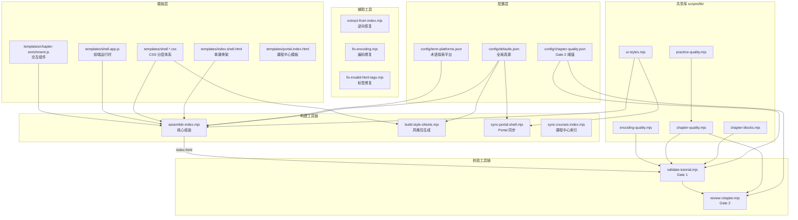
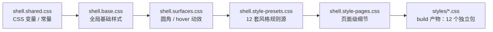
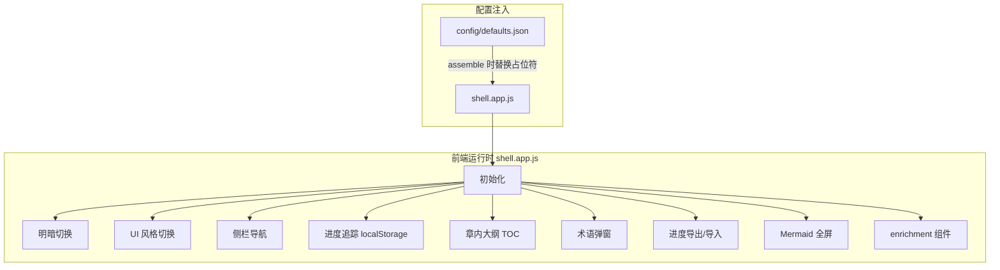
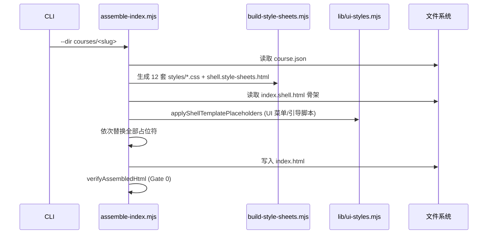
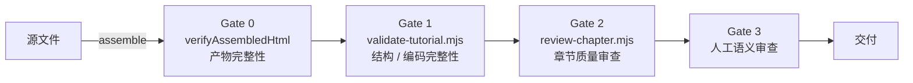

# ARCHITECTURE.md

> `programming-html-tutorial` 技术架构与关键设计决策

---

## 1. 项目定位

将任意技术领域生成为 **纯静态 HTML 交互式教程站**。产物为零后端静态文件，支持浏览器 `file://` 直接打开或任意静态服务部署。

| 属性 | 值 |
|------|-----|
| 壳版本 | `2.10.1`（`config/defaults.json` → `shellVersion`） |
| 运行时 | Node.js ≥18，ESM 模块 |
| 产物 | 单文件 `index.html`（含内联 CSS/JS） |
| 依赖 | highlight.js + Mermaid（CDN 加载） |

---

## 2. 顶层架构



---

## 3. CSS 分层架构

CSS 采用 **五层递进式** 架构，每层职责清晰，通过 `data-ui-style` 属性实现 12 套风格的互斥加载。



### 3.1 各层职责

| 层 | 文件 | 职责 | 变更频率 |
|----|------|------|----------|
| **变量常量** | `shell.shared.css` | `--accent`、`--bg`、`--fg`、间距/字体/半径等设计令牌 | 低 |
| **全局基础** | `shell.base.css` | 布局（topbar、sidebar、main-area）、基础组件（btn、card、table） | 中 |
| **表面属性** | `shell.surfaces.css` | 圆角、阴影、hover 动效、卡片表面 | 低 |
| **风格规则源** | `shell.style-presets.css` | 12 套 UI 风格的规则块（`[data-ui-style="X"]` 选择器） | 新增风格时 |
| **页面细节** | `shell.style-pages.css` | 页面级风格细节 | 低 |
| **构建产物** | `styles/{id}.css` | `build-style-sheets.mjs` 自动生成 | 每次 assemble |

### 3.2 主题与 UI 风格解耦

```
data-theme  （明暗）    → theme.css accent 色（课程主题色）
data-ui-style（风格）   → shell.style-presets.css（字体/间距/圆角/hover）
```

- **`data-theme`**：由 `GLOBAL_THEME_KEY`（localStorage）驱动，控制明暗模式。accent 色继承自 `theme.css` 的 `--accent` 变量。
- **`data-ui-style`**：12 套风格互斥——组装后 12 个 `<style data-ui-style-sheet>` 标签仅当前风格启用、其余 `disabled`。
- **结构风**（compact / outline / soft）：通过 `--accent` 继承课程主题色；**accent 驱动风**（cyber / terminal 等）：内置固定色彩。

### 3.3 新增风格的步骤

1. `config/defaults.json` → `uiStyles[]` 追加 `{ "id", "label" }`
2. `templates/shell.style-presets.css` → 追加 `[data-ui-style="X"]` 规则块
3. `templates/shell.style-pages.css` → 追加页面细节
4. `templates/shell.base.css` → 若需修改 `HOVER_TOKENS`，追加 `[data-ui-style="X"]` hover token

---

## 4. JavaScript 运行时架构



### 4.1 关键全局变量（assemble 时注入）

| 占位符 | 来源 | 注入时机 |
|--------|------|----------|
| `{{GLOBAL_THEME_KEY}}` | `defaults.globalThemeKey` | `applyShellAppPlaceholders` |
| `{{GLOBAL_UI_STYLE_KEY}}` | `defaults.globalUiStyleKey` | `applyShellAppPlaceholders` |
| `{{UI_STYLE_IDS_JSON}}` | `uiStyleIds(defaults)` | `applyShellAppPlaceholders` |
| `{{DEFAULT_UI_STYLE}}` | `defaults.defaultUiStyle` | `applyShellTemplatePlaceholders` |

---

## 5. 构建管道

### 5.1 assemble-index.mjs 主流程



### 5.2 占位符替换顺序

| 顺序 | 占位符 | 源 |
|------|--------|-----|
| 1 | `{{TITLE}}` | `course.meta.title` |
| 2 | `{{HLJS_LANG_SCRIPTS}}` | `meta.hljsLanguages` → CDN script 标签 |
| 3 | `{{TERM_PLATFORM_LINKS}}` | `config/term-platforms.json` → `<a>` 标签 |
| 4 | `{{SHELL_SHARED_CSS}}` | `shell.shared.css` |
| 5 | `{{SHELL_BASE_CSS}}` | `shell.base.css` |
| 6 | `{{THEME_CSS}}` | `theme.css` + enrichment.base.css（可选） |
| 7 | `{{SHELL_SURFACES_CSS}}` | `shell.surfaces.css` |
| 8 | `{{SHELL_STYLE_SHEETS_HTML}}` | `shell.style-sheets.html`（build 产物） |
| 9 | `{{WELCOME_HTML}}` | `welcome.partial.html` |
| 10 | `{{CHAPTERS_HTML}}` | `chapters/*.html` 拼接 |
| 11 | `{{QUIZ_HTML}}` | `quiz.partial.html` |
| 12 | `{{COURSE_DATA_JSON}}` | `course.json` JSON 序列化 |
| 13 | `{{SHELL_APP_JS}}` | `shell.app.js`（经 `applyShellAppPlaceholders`） |

---

## 6. 质量控制闸门体系



| 闸门 | 脚本/方式 | 检查范围 | 容错 |
|------|-----------|----------|------|
| **Gate 0** | `assemble-index.mjs` 内置 | 关键 DOM 元素存在性、占位符残留 | 0 error |
| **Gate 1** | `validate-tutorial.mjs` | 目录结构、编码破损、必填 DOM 块、id 冲突、大纲一致性 | 0 error |
| **Gate 2** | `review-chapter.mjs` | 术语密度、测验完整性、教学法块、动手练习对齐、非法标签 | 0 error |
| **Gate 3** | 人工（`reference/chapter-quality-rubric.md`） | 语义质量、讲透程度、示例恰当性 | 主观判断 |

---

## 7. 源文件与产物分离

```
courses/<slug>/
├── course.json              ← 大纲与元数据（源）
├── theme.css                ← 主题色（源）
├── welcome.partial.html      ← 欢迎页（源）
├── quiz.partial.html         ← 测验数据（源）
├── chapters/*.html           ← 各章正文（源）
└── index.html               ← 组装产物（勿手工编辑）
```

> **原则**：内容编辑只改源文件；`index.html` 由 `assemble-index.mjs` 生成，不应手工编辑。`extract-from-index.mjs` 和 `extract-chapter-from-index.mjs` 支持从产物逆向恢复源文件（灾难恢复）。

---

## 8. 多课工作区

```
<workspace>/
├── courses/
│   ├── index.html           ← 课程中心页（portal.index.html 复制）
│   ├── courses.json         ← 课程目录索引
│   ├── courses-README.md    ← 使用说明
│   └── <slug>/
│       ├── course.json + index.html + ...
│       └── ...
```

- **课程中心页**由 `sync-portal-shell.mjs` 同步壳层 CSS/JS
- **课程目录**由 `sync-courses-index.mjs` 维护 `courses.json` 和 `index.html`
- 每门课独立 `slug/index.html`，可单独分发

---

## 9. 关键设计决策记录

### 9.1 为何采用 `data-ui-style` 属性而非类名

- **互斥性**：12 套风格同时存在于 DOM 中，通过 `disabled` 属性互斥。类名切换会导致样式交叉覆盖。
- **可调试性**：开发者工具中可看到所有风格规则，便于对比调试。

### 9.2 为何 CSS 变量与 `[data-ui-style]` 嵌套选择器而非 CSS 自定义属性

- 多套风格需要不同的盒模型、字体栈、间距体系，CSS 自定义属性在 12 套间切换时过于复杂。
- `[data-ui-style="X"]` 前缀确保每套风格完全隔离，不会相互污染。

### 9.3 为何 assemble 时内联所有 CSS/JS 而非外部引用

- **零依赖部署**：单个 `index.html` 可直接用浏览器打开，无需 Web 服务器。
- **离线可用**：除 CDN 的 highlight.js 和 Mermaid 外，所有资源内联。

### 9.4 为何章节测验与正文同一次写入

- 测验 prompt 必须引用正文中的术语与概念，分离写入容易导致 ID 不同步。
- 工作流 B 中同次写入 `chapters/*.html` + `quiz.partial.html` + `course.json.quizzes`。

### 9.5 为何 UI 风格菜单标记采用注释而非占位符

- `<!-- ui-style-menu:start -->` 等标记允许 `applyPortalUiStyleFragments` 精确替换 portal 模板中的配置块，同时保留模板其余部分不变。
- 支持增量更新：修改 `defaults.json` 后仅需 replace 标记区间，不影响手写代码。

---

## 10. 模块依赖图

```
assemble-index.mjs
  ├── lib/ui-styles.mjs  →  config/defaults.json
  ├── build-style-sheets.mjs  →  templates/shell.style-presets.css
  │                           →  templates/shell.style-pages.css
  └── templates/index.shell.html

validate-tutorial.mjs
  ├── lib/chapter-blocks.mjs    →  config/defaults.json
  ├── lib/chapter-quality.mjs   →  config/chapter-quality.json
  │   └── lib/practice-quality.mjs
  └── lib/encoding-quality.mjs

review-chapter.mjs
  └── lib/chapter-quality.mjs  →  lib/practice-quality.mjs

sync-portal-shell.mjs
  └── lib/ui-styles.mjs  →  config/defaults.json

fix-encoding.mjs (独立，无库依赖)
extract-from-index.mjs (独立)
extract-chapter-from-index.mjs (独立)
fix-invalid-html-tags.mjs (独立)
bootstrap-templates.mjs (独立)
```

---

## 11. npm 脚本

| 命令 | 用途 |
|------|------|
| `npm run assemble -- --dir courses/<slug>` | 组装单课 `index.html` |
| `npm run validate -- --dir courses/<slug>` | 运行 Gate 1 校验 |
| `npm run extract -- --dir courses/<slug>` | 从 `index.html` 逆向恢复源文件 |
| `node scripts/fix-encoding.mjs --dir courses/<slug>` | 修复编码问题 |
| `node scripts/review-chapter.mjs --dir courses/<slug> --chapter <id>` | 运行 Gate 2 审查 |
| `npm test` | 运行单元测试（`node --test scripts/lib/*.test.mjs`） |
